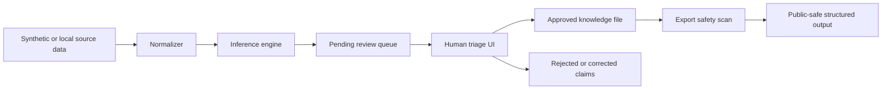

# Inference Triage Architecture

Inference Triage is a local-first review loop. It is designed to turn generated claims into reviewed knowledge without publishing the raw source material.

## Components

| Component | Responsibility |
|---|---|
| Ingestors | Read source material and normalize it into reviewable items. Public demos should use synthetic inputs only. |
| Inference engine | Proposes claims from normalized context. Claims are not trusted automatically. |
| Triage UI | Lets a reviewer approve, reject, or edit each claim. |
| Local JSON store | Persists prototype data locally. Generated JSON is ignored by git. |
| Export guardrail | Blocks export when approved payloads appear to contain API keys, tokens, or private keys. |

## Public Demo Mode

The public demo mode should use:

- `scripts/generate_mock_data.py`
- synthetic people, accounts, interests, and evidence snippets
- no real message exports
- no real browser history
- no real contact exports
- no private screenshots

## Production Gaps

A production version would need authentication, encrypted storage, per-source permissions, audit logs, retention controls, stronger data-loss prevention, and a stricter review workflow for ambiguous claims.
